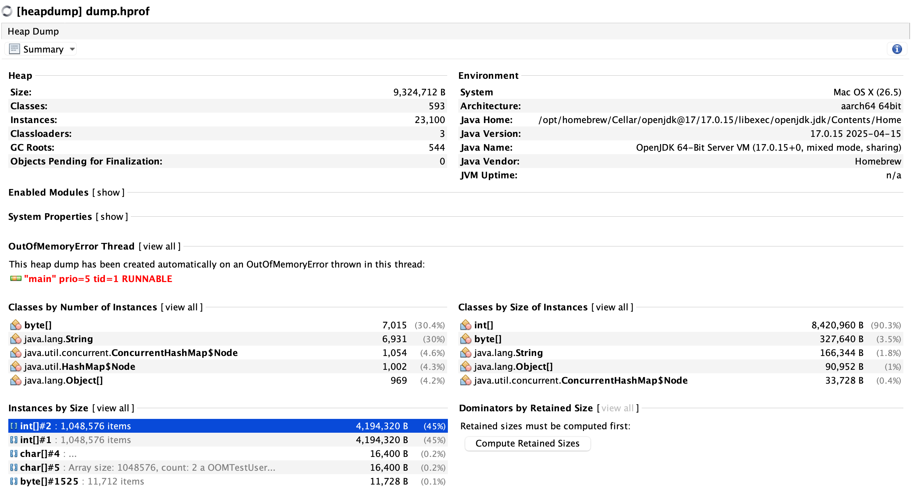

# 堆溢出异常

堆溢出异常（OutOfMemoryError）是指当 Java 虚拟机无法再分配对象时抛出的异常。这通常是由于程序创建了过多的对象，或者某些对象占用了过多的内存，导致堆空间不足。

## 触发条件

- **大量对象创建**：程序在短时间内创建了大量对象，超过了堆的容量。
- **内存泄漏**：程序中存在内存泄漏，即对象不再被使用但仍然被引用，无法被垃圾回收器回收。
- **大对象分配**：程序尝试分配一个非常大的对象，超过了堆的容量。
- **堆设置过小**：JVM 的堆大小设置过小，无法满足程序的内存需求。

## 解决方案

- **减少对象创建**：程序中创建的对象数量过多，导致堆空间不足。可以通过减少对象创建的数量来解决。
- **优化内存使用**：程序中存在内存泄漏，导致堆空间不足。可以通过优化内存使用来解决。
- **增加堆大小**：JVM 的堆大小设置过小，无法满足程序的内存需求。可以通过增加堆大小来解决。

## 示例代码

通过配置小内存并分配大对象来触发堆溢出异常。

```java
import java.util.ArrayList;
import java.util.List;

public class OOMTest {
    // 通过 -Xmx10m -Xms10m -XX:+HeapDumpOnOutOfMemoryError
    // -XX:HeapDumpPath=./dump.hprof 来触发堆溢出异常
    // 并生成 dump.hprof 文件

    // javac OOMTest.java
    // java -Xms10m -Xmx10m -XX:+HeapDumpOnOutOfMemoryError
    // -XX:HeapDumpPath=./dump.hprof OOMTest

    private static final String TEST_NAME = "OOMTestUser";

    public static void main(String[] args) {
        int count = 0;
        List<int[]> list = new ArrayList<>();
        System.out.println("Testing OOM and analysis! I am a " + TEST_NAME);
        while (true) {
            count++;
            int[] array = new int[1024 * 1024]; // 1MB
            System.out.println("Array size: " + array.length + ", count: " + count);
            list.add(array);
        }
    }
}

```

## 堆溢出异常分析

使用VisualVM工具分析堆溢出异常。可以看到list对象占用了大量的内存，导致堆溢出异常。

